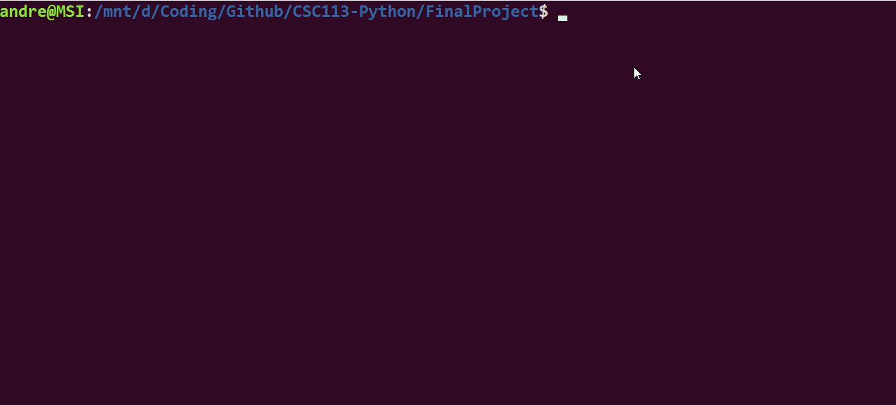

# Alphabet Detector

Alphabet Detector is a python project that recognizes an alphabet base on the concept of the neural network. The project implements the random library to generate training sets and testing sets and store those into the text file with file handling. The output of the project will consist of the result of recognition.

## Usage

```bash
python3 Neural_Network.py
```

## Demonstration



## Credits
@VictoriaXY6
